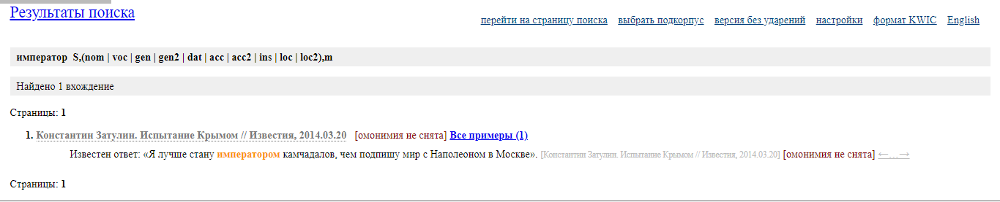
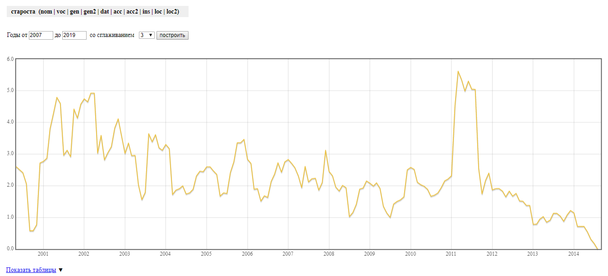
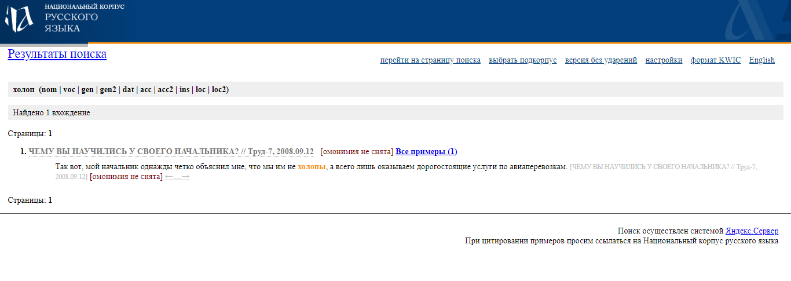

# Как мы барина в XXI веке не нашли

## На чем Русь-матушка держится?
### Теория закусочной

+ Самодержавие
+ Император
+ Казначей
+ Полиция
+ Жильцы
+ Горожане
+ Староста
+ Барин
+ Дворецкий
+ Холоп
+ Интеллигенция

 ## НКРЯ
  + Что мы искали в НКРЯ: в каком контексте используются выбранные нами слова 
  + Что мы нашли в НКРЯ: контекст употреблений слов и много странных статей. 
  + Алгоритм действий: все слова искались в газетном подкорпусе, задавались грамматические характеристики (то есть любой падеж и число), затем в распределении по годам настраивался нужный интервал (от 2007 до 2019). 
  + Интересно то, что НКРЯ не захотел искать слово «барин» в газетном подкорпусе.
  + Самодержавие
  
  
  
    + [Cтатья](https://iz.ru/news/528205)
  + Император
  
  
  
    + [Cтатья](https://globalaffairs.ru/global-processes/Ispytanie-Krymom-16517)
  + Казначей
  
  
  
    + [Cтатья](https://www.kuban.kp.ru/daily/24460/622314/)
  + Интеллигенция
  
  
  
    + [Cтатья](https://www.kp.ru/daily/26255/3135134/)
  + Полиция
  
  
  
    + [Cтатья](https://www.msk.kp.ru/daily/26252.5/3132449/)
  + Жильцы
  
  
  
    + [Cтатья]( https://iz.ru/news/568958)
  + Закусочная
  
  
  
    + [Cтатья](https://woman.rambler.ru/cooking/23478668-vlasti-argentiny-ostavili-klientov-mcdonald-s-bez-ketchupa/)
  + Староста
  
  
  
    + [Cтатья](https://iz.ru/news/514390)
  + Дворецкий
  
  
  
    + [Cтатья](https://www.kp.ru/daily/26153.3/3041345/)
  + Горожане
  
  
  
   + [Cтатья](https://iz.ru/news/570245) 
   
  + Холоп
  
  
  
    + [Cтатья](http://www.trud.ru/article/12-09-2008/133223_chemu_vy_nauchilis_u_svoego_nachalnika.html)
  

## [Наш корпус](https://drive.google.com/open?id=1CTlcs6Uwd9aSpvOYV_qW9NizbWJBjZQW)

## Первоначальное значение 

+ Горожанин - человек, являющийся подданным того или иного государства. (= гражданин)

+ Самодержавие - власть национально-независимая, не ограниченная чужеземным государством.

+ Император (imperо "полководец, повелитель") – талантливый полководец, триумфатор.

+ Казначей – лицо, ведающее приемом, хранением и выдачей денежного, вещевого и технического довольствия в войсковых частях.

+ Холоп - люди несвободного состояния, рабы в Древней Руси.

+ Дворецкий - управляющий князя, ведавший дворцовыми землями, хлебопашеством на них, а также крестьянами и дворцовыми слугами.

+ Интеллигенция (intelligentia «понимание») – группа сообразительных людей, обладающих критическим мышлением.

+ Староста - избираемый коллегией выборщиков глава города с упрощённым городским управлением в Российской империи.

+ Полиция - добровольная военная дружина, народное (земское) ополчение.

+ Жильцы – охранное войско, во время походов и царских выездов составляли особый отряд гвардии, а также сопровождали монарха на богомолье; должны были всегда жить в Москве и быть готовыми к службе и войне.

+ Закусочная – питейное заведение по типу кабака.
### Семантический калькулятор в RusVectōrēs
В качестве базовой комбинации в составлении пропорции были выбраны слова "чело" и "лоб", соотносящиеся как абсолютные синонимы разных годов употребления.
Мы попробовали выяснить современные аналоги исследуемых слов, некоторые результаты были весьма неожиданными:
+ «Горожанин» утратил связь между словом «гражданин», и теперь наиболее известен как «прохожий» 
 
+ «Дворецкий» из высокопоставленного лица превратился в «лакея» 
 

+ «Жилец» из войсковых отрядов перебрался в многоэтажку, и теперь он всего лишь «квартирант»

 
+ «Закусочная» расширила свой ассортимент до «кафе»
 

+ Звание «императора» никак не поделят между собой Наполеон и Вильгельм Завоеватель

 
+ «Казначей» превратился в рядового «бухгалтера»

+ Другие слова в целом сохранили свое значение

+ Самодержавие

+ Полиция

+ Холоп

+ Интеллигенция

+ Староста

### Voyant Tools
+ Мы воспользовались данной программой для составления "облаков" ключевых слов. Сначала были сделаны "облака" отдельно для каждого текста, в котором исследуемое слово употребляется в первоначальном значении, а затем было составлено "облако" для всего корпуса. Исходя из полученных результатов можно говорить о преобладании следующих моделей, определяющих содержание текста: - 

+ «Самодержавие»:

+ «Староста»: церковь - пожертвования

+ «Холоп»: начальник-подчиненный

+ «Горожане»: человек - городская жизнь

+ «Дворецкий»: работа – зарплата

+ «Жильцы»/ «Император»: Крым – Россия - Украина

+ «Интеллигенция»: дети – полиция

+ «Казначей»: школа – деньги

+ «Закусочная»: McDonald’s – экономика

  + Самые обсуждаемые темы всего корпуса: : образование – Крым*
  
  
  
  ## AntConc

1. Мы смотрели на то, какой контекст у каждого слова. Для этого мы воспользовались вкладкой Concordance. Благодаря ей мы увидели, что такие слова, как дворецкий, жильцы, интеллигенция, полиция в значительной мере изменили свои значения, о чём свидетельствует контекст, в котором эти слова употребляются. Остальные 4 слова (к которым смогли применить программу) не претерпели семантических изменений.

2. К сожалению, слова закусочная, император и холоп не смогли быть проверены через данную программу по неизвестным нам причинам. Однако о них можно судить из материала НКРЯ.

3. Для наглядности приводим скрины
  + Казначей
  
  + Горожанин
  
  + Дворецкий
  
  + Интеллигенция
  
  + Полиция
  
  + Самодержавие
  
  + Жители
   
  + Староста
  
  
4.	Кроме того, мы использовали такую возможность AntConc, как Collocates. Она обозначает словосочетание, имеющее признаки синтаксически и семантически целостной единицы, в котором выбор одного из компонентов осуществляется по смыслу, а выбор второго зависит от выбора первого. В ходе работы с этой особенностью программы мы рассмотрели всевозможные словосочетания со словами, входящими в наш список. 
5.	Мы убедились, что данные словосочетания показывают изменения смысла, только в более развёрнутом варианте.
6.	Для наглядности мы прилагаем скрины:
  + Казначей
  
  + Горожанин
  
  + Дворецкий
  
  + Интеллигенция
  
  + Полиция
  
  + Самодержавие
  
  + Жители
   
  + Староста
  
 
  
  ## Выводы:
1.	Семантика слова способна сохраняться на протяжении двух и более столетий. При этом использование подобных слов в газетных статьях никак не повлияло на значение, лишь на контекст, который, впрочем, преимущественно оставался в рамках первоначального смысла.
2.	С другой стороны, всё же есть слова, подвергшиеся изменению, особенно под влиянием прессы. Подобные случаи доказывают, что газетные сенсации используют старую лексику для объяснения современных фактов путём преобразования смысла.
3.	В ходе работы над проектом наша гипотеза частично подтвердилась. Слова действительно изменили семантику под влиянием времени и прессы, хотя некоторые всё же способны сохранять первоначальное значение.

  

